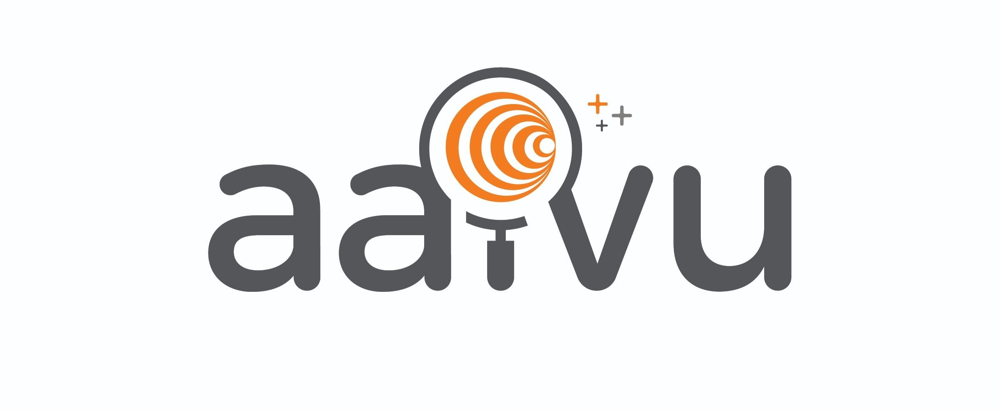

# Aaivu

# Welcome to Aaivu organization

Welcome to Aaivu Organization! We do research and projects to help the people with the help of NLP.

Natural language processing (NLP) is a subfield of linguistics, computer science, information engineering, and artificial intelligence concerned with the interactions between computers and human (natural) languages, in particular how to program computers to process and analyze large amounts of natural language data.

“Aaivu” organization is an open-source organization to enhance and enrich the lives of the community who will benefit from NLP. These are our objectives,

- We engage in NLP based projects to adapt the projects that were done for languages such as English to local languages such as Tamil and Sinhala.
- We use techniques such as word embedding to understand and analyze the languages and implement them in a useful manner.
- We do Data Mining to support these ventures.
Let’s together to contribute.

# Aaivu Talk Forum

Visit Aaivu Talk forum at https://talk.aaivu.org/ for our discussion platform and a place where you can hang out and talk about Aaivu related projects with other community members. Talk forum is an online home for Aaivu users, researchers, and contributors to learn from each other, share experiences ... or just to make and build friendships.

# Projects

[][aaivu_projects_url]  [][aaivu_2020_projects_url]

Please visit to our [Projects page][aaivu_projects_url] to get more details. 

# Code of Conduct

We expect you to carefully go through our Code of Conduct documentation to pledge befor making participation to our project and community. Please visit to our [Code of Conduct page][aaivu_cod_url] to get more details. 

# Help desk

[][github_access_request]
[][github_new_project]
[][common_request]

Please reach us via this [Help Desk form][aaivu_help_desk] to request access to the documentation for edit/write access and Github write access. You can always browse anonymously, but we are now manually granting some access to prevent spam.

- If you have any community related questions, please ask in the [Aaivu Talk forum][aaivu_talk_url]

[aaivu_projects_url]: https://github.com/aaivu/aaivu-introduction/blob/master/PROJECTS.MD
[aaivu_2020_projects_url]: https://github.com/aaivu/aaivu-introduction/blob/master/PROJECTS.MD
[aaivu_talk_url]: https://talk.aaivu.org
[aaivu_cod_url]: https://github.com/aaivu/aaivu-introduction/blob/master/docs/code_of_conduct.md
[aaivu_help_desk]: https://github.com/aaivu/aaivu-introduction/blob/master/HELP_DESK.MD

[github_access_request]: https://docs.google.com/forms/d/e/1FAIpQLSckX_eLMExKfwAQdsY-OzSfWnTwRBDOmupgZRzDGTEtGh53jg/viewform?usp=sf_link
[github_new_project]: https://docs.google.com/forms/d/e/1FAIpQLSeBhLIcmb7vwEi_L521lQMCcn7M173EcFCAGVh8Ty_pxQEUHQ/viewform?usp=sf_link
[common_request]: https://docs.google.com/forms/d/e/1FAIpQLSdqQj94a9w5k5nLS3VQBC3fxrRu5vUv5eUXS8Di9jyaK1jxlw/viewform?usp=sf_link